<h1 align="center">🚀 Snappy — Real-Time Chat Application</h1>

  A full-stack real-time chat application built with the MERN stack + Socket.io.

## ✨ Features

- 🔐 **Secure User Authentication** (registration + login)
- 🖼️ **Dynamic Avatar Selection** using Multi-Avatar API
- 💬 **1-on-1 Real-Time Messaging** powered by Socket.io
- 🗂️ **Persistent Chat History** stored in MongoDB
- 😀 **Emoji Support** in chat input
- 🚀 **Instant Message Delivery** without page refresh

## 🧰 Tech Stack

| Category     | Technology         | Description                           |
| ------------ | ------------------ | ------------------------------------- |
| **Frontend** | React              | Component-based SPA UI                |
|              | Styled Components  | CSS-in-JS styling & responsive design |
|              | React Router       | Client-side routing                   |
|              | Axios              | API client                            |
|              | Emoji-Picker-React | Emoji integration in chat             |
|              | React Icons        | SVG icon set                          |
| **Backend**  | Node.js            | Server runtime                        |
|              | Express.js         | REST API                              |
|              | Socket.io          | Real-time communication               |
|              | Bcrypt             | Password hashing                      |
| **Database** | MongoDB            | NoSQL document store                  |
|              | Mongoose           | ODM for schema & queries              |
| **DevOps**   | Nodemon            | Auto-reload server during development |
| **Other**    | Multi-Avatar API   | Dynamic avatar generation             |
|              | UUID               | Unique IDs for message keys           |
|              | Buffer             | Base64 conversion for avatars         |

## 🏛️ Architecture Overview

```mermaid
flowchart TB
    %% ======== STYLES ========
    classDef client fill:#E3F2FD,stroke:#2196F3,stroke-width:2px,color:#0D47A1;
    classDef backend fill:#E8F5E9,stroke:#4CAF50,stroke-width:2px,color:#1B5E20;
    classDef db fill:#FFF3E0,stroke:#FB8C00,stroke-width:2px,color:#E65100;
    classDef external fill:#F3E5F5,stroke:#9C27B0,stroke-width:2px,color:#4A148C;
    classDef realtime fill:#FCE4EC,stroke:#E91E63,stroke-width:2px,color:#880E4F;
    
    %% ======== CLIENT LAYER ========
    subgraph Client["🖥️ Frontend Layer - React Application"]
        direction TB
        A1[🔐 Register / Login Pages]
        A2[👤 Avatar Selection]
        A3[💬 Chat Interface]
        A4[📋 Contacts List]
        A5[✍️ Message Input + Emoji Picker]
        A6[💾 LocalStorage Session]
        
        A1 --> A6
        A2 --> A3
        A4 --> A3
        A5 --> A3
    end
    
    %% ======== BACKEND LAYER ========
    subgraph Backend["⚙️ Backend Layer - Node.js + Express"]
        direction TB
        
        subgraph API["REST API Layer"]
            B4[🛣️ API Routes]
            B1[🔑 Auth Controller]
            B2[👥 User Controller]
            B3[📨 Message Controller]
            
            B4 --> B1
            B4 --> B2
            B4 --> B3
        end
        
        B5[⚡ Socket.io Server<br/>Real-time Communication]
    end
    
    %% ======== DATABASE LAYER ========
    subgraph Database["💾 Database Layer -    MongoDB"]
        direction LR
        C1[(👤 Users Collection)]
        C2[(💬 Messages Collection)]
    end
    
    %% ======== EXTERNAL SERVICES ========
    subgraph External["🌐 External Services"]
        D1[🎨 Multi-Avatar API<br/>Random Avatar Generator]
    end
    
    %% ======== REST API CONNECTIONS ========
    A1 -.->|"POST /api/auth/register<br/>POST /api/auth/login"| B1
    A2 -.->|"POST /api/auth/setAvatar/:id"| B2
    A4 -.->|"GET /api/auth/allusers/:id"| B2
    A3 -.->|"POST /api/messages/getmessages"| B3
    A5 -.->|"POST /api/messages/addmessage"| B3
    
    %% ======== DATABASE CONNECTIONS ========
    B1 ==>|Create & Authenticate Users| C1
    B2 ==>|Update Avatar & Fetch Users| C1
    B3 ==>|Save Messages| C2
    B3 ==>|Retrieve Chat History| C2
    
    %% ======== WEBSOCKET CONNECTIONS ========
    A3 <===>|"🔌 WebSocket Connection<br/>• connect<br/>• add-user"| B5
    A5 ===>|"📤 send-message"| B5
    B5 ===>|"📥 message-receive"| A3
    
    %% ======== EXTERNAL API CONNECTION ========
    A2 -.->|"GET Avatar Images"| D1
    
    %% ======== APPLY STYLES ========
    class Client,A1,A2,A3,A4,A5,A6 client;
    class Backend,API,B1,B2,B3,B4 backend;
    class B5 realtime;
    class Database,C1,C2 db;
    class External,D1 external;
```

## Images

